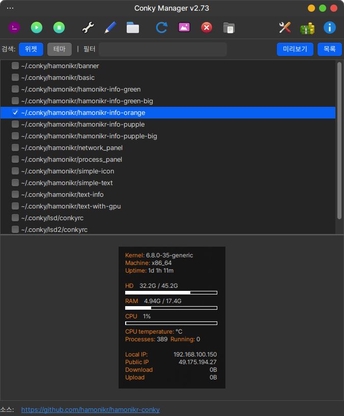

# hamonikr-conky

하모니카에서 제공하는 바탕화면의 모니터링 도구 Conky 설정을 돕는 도구.

 * HamoniKR, Ubuntu, LinuxMint 지원
 * upstream : https://github.com/zcot/conky-manager2
 * binary : https://launchpad.net/~afelinczak/+archive/ubuntu/ppa?field.series_filter=focal
 


## Install

### Ubuntu, Debian, LinuxMint
터미널을 열고(Ctrl+Alt+T) 아래 명령어를 입력하세요.

```
curl -sL https://pkg.hamonikr.org/add-hamonikr.apt | sudo -E bash -

sudo apt install -y hamonikr-conky
```

## Usage
 * 프로그램 > `conky 설정도구` : 바탕화면의 Conky 테마를 설정하는 프로그램
 * 프로그램 > `conky 온/오프` : Conky 사용을 온/오프 하는 프로그램


## Build instruction

* [BUILD Document](HOWTOBUILD.md)

###  테마를 추가하고 패키지할 때

1) 소스코드 중 아래 압축파일을 풀면 테마가 저장되는 .conky 폴더가 있습니다.
`src/share/conky-manager2/themepacks/default-themes-2.1.cmtp.7z`

2) .conky 폴더안에 추가하기 원하는 테마를 넣고 다시 압축을 합니다. (7z)

3) 같은 폴더에 `default-themes-x.x.cmtp.7z` 형식으로 이름을 수정합니다.

4) .conky 폴더와 이전에 있던 default-themes-2.1.cmtp.7z 파일은 삭제합니다.

5) debian 패키지로 빌드하고 배포합니다.


## 이슈 또는 버그
 사용 중 문제를 발견하시면 이슈를 등록하시거나, https://hamonikr.org 에서 알려주세요.
